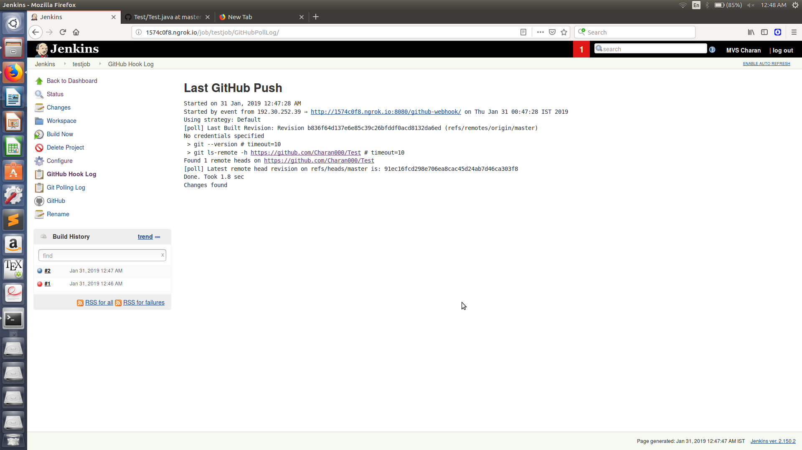
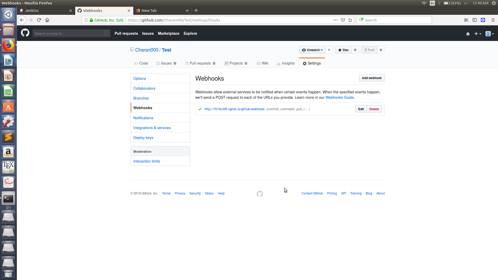
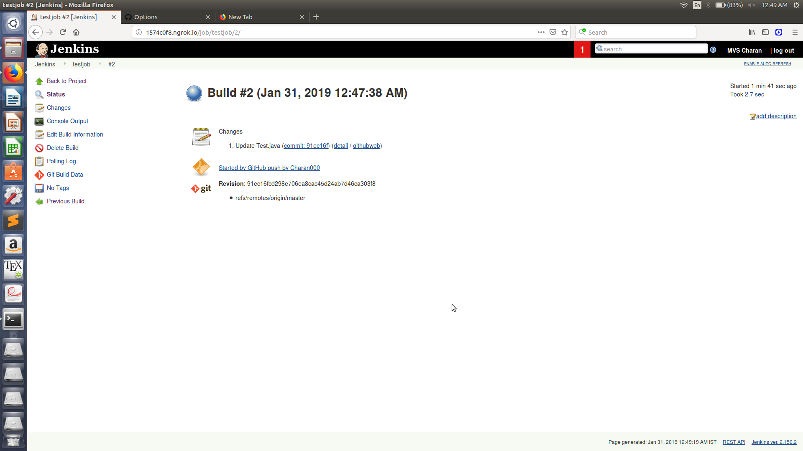
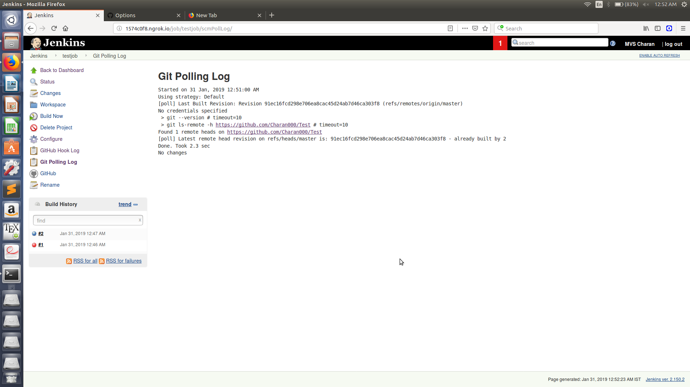

# jenkins-github Assignment
- Create a simple Job, and the build action of the job can be something simple like ```echo "Hello World!"```
- Connect the job to your GitHub Assignment repository using Git SCM Poll for every 5 seconds
- Whenever you commit to your repository, the Jenkins job should run automatically.


## Jenkins Assignment -

1) I created a running java program that prints "Hello World!" as a new job in jenkins.
2) I configured the job such that checks for a change for every 5 minutes.
3) I webhooked it with github such that it builds when a new commit is done.

Here are the screenshots of the results.





